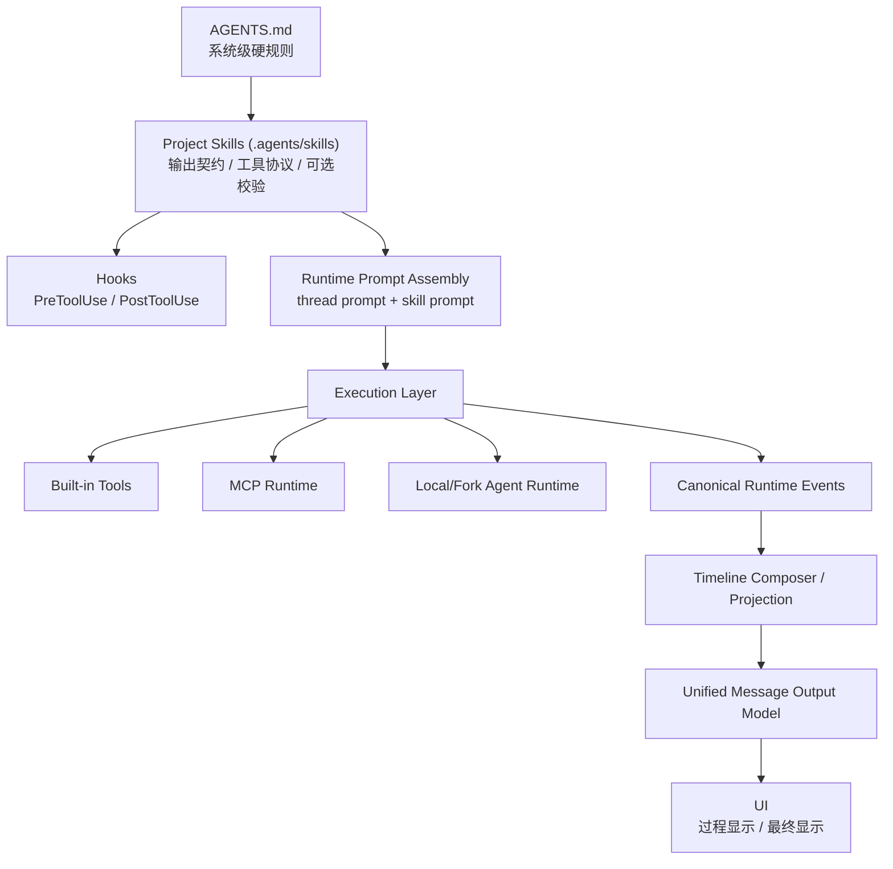

# AI Runtime System Simplification Implementation Plan

> **For agentic workers:** REQUIRED SUB-SKILL: Use superpowers:subagent-driven-development (recommended) or superpowers:executing-plans to implement this plan task-by-task. Steps use checkbox (`- [ ]`) syntax for tracking.

**Goal:** 收敛 GoodNight AI Chat 的系统级边界，统一 thinking / tool / feedback / final 的真相源，减少渲染补丁逻辑，并用 `AGENTS.md + project skills + thin runtime parser` 代替当前偏重的 UI 修补方案。

**Architecture:** 保持现有分层顺序 `provider protocol adapters -> canonical runtime events -> timeline composer / conversation projection -> assistant render model / UI composition`。把“输出契约”前移到 `AGENTS.md + .agents/skills`，把代码层收缩成“解析、归档、显示”三件事，不再让多个 UI 分支各自发明一套消息语义。

**Tech Stack:** Tauri, React 19, TypeScript, Zustand, runtime sidecar, local skills (`SKILL.md`), repo `AGENTS.md`

---

## 系统级判断

这是系统级改造，不是单个组件样式修复。

范围包括：
- AI 输出协议
- skill / hook / MCP / agent 的职责边界
- runtime streaming truth
- canonical event 到 timeline projection 的归一化
- 最终 UI 呈现模型

不应再继续用“局部 suppress 规则”修视觉问题。

## 当前系统架构

### 1. 当前 AI 运行时主链路

1. Provider / local agent 产出 `thinking`、`text`、`tool_call`
2. Runtime 把这些事件写入 assistant timeline / canonical event store
3. Timeline composer / conversation projection 生成过程卡片和结果摘要
4. Assistant render model 再次拆分正文、思考、工具、草稿
5. `AIChat.tsx` / `GNAgentMessageItem.tsx` 再按运行中与完成态做显示拼装

### 2. 当前主要问题

1. `thinking`、`feedback`、`final` 没有硬边界，过程文本经常被当成最终正文的一部分。
2. 工具展示既有 runtime/canonical truth，也有正文级 raw `<tool_use>` 兼容路径，导致双轨。
3. 过程区和结果区并非同一条 message output source，完成后和运行中的可见内容会飘。
4. skill 已经存在，但项目 skill 发现链路还没有完整接到仓库 `.agents/skills`。
5. `mcp`、`agent`、`hook`、`skill` 的职责在产品设计上还没有明确收敛。

## 目标架构

### 1. AI 输出契约

- `thinking`: 仅运行时状态，不显示正文，不持久化为最终回答
- `tool`: 仅 runtime / canonical tool events 为真相源
- `feedback`: 可选、短、临时，仅过程可见，不持久化为最终正文
- `final`: 唯一最终正文，唯一持久化回答体

### 2. 技能体系定位

- `AGENTS.md`: 系统级硬规则
- `skill`: 给模型的工作说明书和输出约束
- `hook`: skill 的自动前后置动作
- `mcp`: 独立工具协议层
- `agent`: 独立执行层

### 3. 技能体系设计图

## 需要创建的内容

### 新建系统级 skill

- Create: `.agents/skills/ai-chat-output-boundary/SKILL.md`
- Create: `.agents/skills/workspace-tooling-protocol/SKILL.md`
- Optional Create: `.agents/skills/verification-hooks/SKILL.md`

### 新建运行时/渲染收敛模块

- Create: `src/modules/ai/runtime/output/assistantOutputTypes.ts`
- Create: `src/modules/ai/runtime/output/parseStructuredAssistantOutput.ts`
- Create: `src/modules/ai/runtime/output/buildAssistantMessageOutputModel.ts`

## 需要修改的内容

### 系统规则与 skill 装载

- Modify: `AGENTS.md`
- Modify: `src-tauri/src/lib.rs`
- Modify: `src/modules/ai/skills/skillLibrary.ts`
- Modify: `src/modules/ai/runtime/skills/runtimeSkillRegistry.ts`
- Modify: `src/modules/ai/runtime/context/buildThreadPrompt.ts`
- Modify: `src/modules/ai/chat/directChatPrompt.ts`

### 输出协议与运行时归一化

- Modify: `src/modules/ai/runtime/orchestration/agentTurnRunner.ts`
- Modify: `src/modules/ai/runtime/orchestration/runtimeChatTurnStreaming.ts`
- Modify: `src/modules/ai/runtime/orchestration/runtimeChatTurnCoordinator.ts`
- Modify: `src/modules/ai/store/assistantTimeline.ts`

### UI 渲染层收敛

- Modify: `src/components/workspace/assistantRenderModel.ts`
- Modify: `src/components/workspace/AIChat.tsx`
- Modify: `src/components/ai/gn-agent/GNAgentMessageItem.tsx`
- Modify: `src/components/workspace/timeline/chatTimelineBubbleCardModel.ts`
- Modify: `src/components/workspace/timeline/chatMessageTimelineRenderModel.ts`

### 测试与文档

- Modify: `tests/ai/runtime-streaming-assembler.test.mjs`
- Modify: `tests/ai/runtime-chat-turn-streaming.test.mjs`
- Modify: `tests/ai/assistant-render-model.test.mjs`
- Modify: `tests/ai/ai-chat-runtime-output-flow.test.mjs`
- Modify: `tests/ai/ai-chat-direct-streaming-display-source.test.mjs`
- Modify: `tests/ai/gn-agent-message-item.test.mjs`
- Add: `tests/ai/project-skill-discovery-source.test.mjs`

## 计划删除或退役的内容

- Retire: `src/components/workspace/aiChatMessageParts.ts` 中基于正文解析 `<tool_use>` / `<tool_result>` 的主展示职责
- Retire: `AIChat.tsx` 中“如果 timeline 已有 tool event 就 suppress raw tool block”的主判断路径
- Retire: `chatTimelineBubbleCardModel.ts` 中对 reasoning-only / response card 的补丁式 suppress 作为主策略
- Retire: `agentTurnRunner.ts` 中“过程反馈长期保存为普通 text parts”的默认语义
- Retire: “过程区自己排序、结果区自己排序”的双消息展示模型

## Task 1: 锁定系统级契约

**Files:**
- Modify: `AGENTS.md`
- Create: `.agents/skills/ai-chat-output-boundary/SKILL.md`
- Create: `.agents/skills/workspace-tooling-protocol/SKILL.md`

- [ ] 在 `AGENTS.md` 新增简短的 AI chat output contract，明确 `thinking / tool / feedback / final` 的系统边界。
- [ ] 编写 `ai-chat-output-boundary` skill，只定义输出边界，不混入业务流程。
- [ ] 编写 `workspace-tooling-protocol` skill，只定义读写工具、MCP、agent 的调用优先级和禁止事项。
- [ ] 约束原则：没有工具时只返回 `<final>`；有工具时工具事实来自 runtime，不来自正文复述。

## Task 2: 修复项目 skill 发现链路

**Files:**
- Modify: `src-tauri/src/lib.rs`
- Modify: `src/modules/ai/skills/skillLibrary.ts`
- Test: `tests/ai/project-skill-discovery-source.test.mjs`

- [ ] 扩展 `discover_local_skills`，显式扫描仓库 `.agents/skills`，而不只扫描 GoodNight built-in / imported skill library。
- [ ] 保持系统 skill、导入 skill、项目 skill 的 source 标识清晰可区分。
- [ ] 确保 project skill 可以进入 runtime catalog，并真正出现在 thread prompt 的 `<skills>` 区块里。
- [ ] 新增回归测试，覆盖 `.agents/skills/*/SKILL.md` 被发现、加载、去重的场景。

## Task 3: 引入结构化 assistant 输出模型

**Files:**
- Create: `src/modules/ai/runtime/output/assistantOutputTypes.ts`
- Create: `src/modules/ai/runtime/output/parseStructuredAssistantOutput.ts`
- Modify: `src/modules/ai/runtime/orchestration/agentTurnRunner.ts`
- Modify: `src/modules/ai/runtime/orchestration/runtimeChatTurnStreaming.ts`
- Modify: `src/modules/ai/runtime/orchestration/runtimeChatTurnCoordinator.ts`

- [ ] 定义统一输出类型：`thinking-status`、`feedback`、`final`，其中 `tool` 继续沿用 runtime events，不放进 assistant body。
- [ ] 解析 `<feedback>...</feedback>` 与 `<final>...</final>`，并为无标签的兼容回复制定降级策略。
- [ ] streaming 阶段只允许累积“当前 feedback”或“当前 final”，不再把所有 text 都当成最终正文草稿。
- [ ] 完成阶段只持久化 `final`；`feedback` 只作为 transient process output。

## Task 4: 收敛单一 message output truth

**Files:**
- Create: `src/modules/ai/runtime/output/buildAssistantMessageOutputModel.ts`
- Modify: `src/modules/ai/store/assistantTimeline.ts`
- Modify: `src/components/workspace/assistantRenderModel.ts`
- Modify: `src/components/workspace/timeline/chatMessageTimelineRenderModel.ts`

- [ ] 新增统一 message output model，输入为 canonical timeline、projection、streaming state，输出为一条稳定的可见消息模型。
- [ ] 运行中和完成后都走同一模型，只是显示态不同，不再各自拼装。
- [ ] `assistantRenderModel` 缩小职责，只保留正文/状态映射，不再兼任排序与真假判断。
- [ ] final body 与完成摘要共享同一 message identity，避免“生成后和过程不一致”。

## Task 5: 删除重逻辑与旧兼容路径

**Files:**
- Modify: `src/components/workspace/AIChat.tsx`
- Modify: `src/components/ai/gn-agent/GNAgentMessageItem.tsx`
- Modify: `src/components/workspace/timeline/chatTimelineBubbleCardModel.ts`
- Modify: `src/components/workspace/aiChatMessageParts.ts`

- [ ] 删除 raw `<tool_use>` 文本块作为主时间线来源的路径，仅保留必要的历史兼容兜底。
- [ ] 删除 process lane 与 result lane 各自排序的做法，统一走 message output model。
- [ ] 完成态只渲染一次 `final`，过程内容折叠或清空，不保留半段正文。
- [ ] thinking 在运行中只显示状态 pill，结束即隐藏，不进入最终消息体。

## Task 6: 把 MCP / hook / agent 放回正确层级

**Files:**
- Modify: `.agents/skills/workspace-tooling-protocol/SKILL.md`
- Optional Create: `.agents/skills/verification-hooks/SKILL.md`
- Review: `src/modules/ai/runtime/mcp/runtimeMcpFlow.ts`
- Review: `src/modules/ai/runtime/orchestration/executeRuntimeLocalAgentTurn.ts`
- Review: `src/modules/ai/skills/runtimeSkillPreparation.ts`

- [ ] 在 skill 文案里声明：skill 负责“教模型怎么选工具”，不伪装为 MCP 或 agent 本身。
- [ ] 保持 MCP 为独立工具协议层，skill 只规定何时优先 MCP。
- [ ] 保持 agent 为独立执行层，skill 只规定 `agent` / `context` 偏好。
- [ ] 如果需要自动校验，再单独启用 `verification-hooks`，不要把 hook 塞进 output boundary skill。

## Task 7: 测试、构建、图谱回写

**Files:**
- Modify: `tests/ai/runtime-streaming-assembler.test.mjs`
- Modify: `tests/ai/runtime-chat-turn-streaming.test.mjs`
- Modify: `tests/ai/assistant-render-model.test.mjs`
- Modify: `tests/ai/ai-chat-runtime-output-flow.test.mjs`
- Modify: `tests/ai/gn-agent-message-item.test.mjs`

- [ ] 增加测试：过程区与结果区必须来自同一 message output source。
- [ ] 增加测试：第 N 条 assistant 完成后，第 N+1 轮开始流式时，第 N 条消息不允许再变。
- [ ] 增加测试：只有 `final` 会持久化为正文；`feedback` 不持久化；`thinking` 不显示正文。
- [ ] 增加测试：tool event 只以 runtime/canonical truth 渲染，不因正文文本重复。
- [ ] 运行 `npm run build`。
- [ ] 运行与 AI chat / runtime / skills / MCP 相关测试。
- [ ] 运行 `graphify update .`，若失败，记录现有 graphify 工具问题，不把失败归因到本次改动。

## 验收标准

- 运行中看到的正文与最终正文来自同一 source
- 完成后正文只显示一次
- thinking 不泄漏为正文
- feedback 不污染最终消息
- tool 只走 runtime/canonical event truth
- 新一轮对话不会改写上一轮已完成消息
- `.agents/skills` 中的项目 skill 能被发现并进入 prompt

## 执行顺序建议

1. 先做 Task 1 和 Task 2，先把系统契约和 skill 注入打通
2. 再做 Task 3 和 Task 4，先统一输出语义，再统一展示模型
3. 最后做 Task 5 到 Task 7，删除旧逻辑并补齐测试

## 风险提示

- 最大风险不是功能缺失，而是旧兼容路径未删干净，导致“看起来新逻辑生效，实际上还是双轨”。
- 不要为了 UI 效果去改 provider adapter 或 canonical runtime truth。
- 如果需要兼容老消息，兼容只放在 parser 边界，不要扩散到多个 UI 文件。

## 执行结论

这次改造应被视为“AI 系统主干瘦身”，不是 UI 微调。
优先级应为：系统契约 > 项目 skills > runtime parser > unified output model > 删除旧 UI 逻辑。
